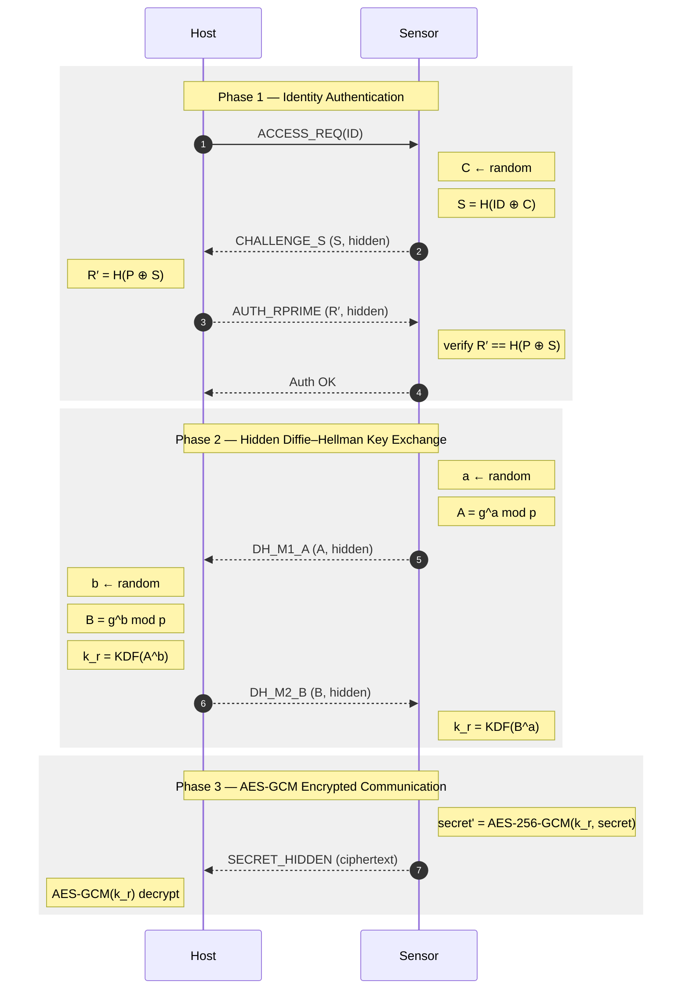

```mermaid
sequenceDiagram
    autonumber
    participant Host
    participant Sensor

    %% =========================
    %% Phase 1: Identity Authentication
    %% =========================
    rect rgb(240,240,240)
    Note over Host,Sensor: Phase 1 — Identity Authentication

    
    Host->>Sensor: ACCESS_REQ(ID)

    Note right of Sensor: C ← random
    Note right of Sensor: S = H(ID ⊕ C)

    Sensor-->>Host: CHALLENGE_S (S, hidden)

    Note left of Host: R′ = H(P ⊕ S)

    Host-->>Sensor: AUTH_RPRIME (R′, hidden)

    Note right of Sensor: verify R′ == H(P ⊕ S)
    Sensor-->>Host: Auth OK
    end

    %% =========================
    %% Phase 2: DH Key Exchange
    %% =========================
    rect rgb(240,240,240)
    Note over Host,Sensor: Phase 2 — Hidden Diffie–Hellman Key Exchange

    Note right of Sensor: a ← random
    Note right of Sensor: A = g^a mod p

    Sensor-->>Host: DH_M1_A (A, hidden)

    Note left of Host: b ← random
    Note left of Host: B = g^b mod p
    Note left of Host: k_r = KDF(A^b)

    Host-->>Sensor: DH_M2_B (B, hidden)

    Note right of Sensor: k_r = KDF(B^a)
    end

    %% =========================
    %% Phase 3: Secure Communication
    %% =========================
    rect rgb(240,240,240)
    Note over Host,Sensor: Phase 3 — AES-GCM Encrypted Communication

    Note right of Sensor: secret' = AES-256-GCM(k_r, secret)

    Sensor-->>Host: SECRET_HIDDEN (ciphertext)

    Note left of Host: AES-GCM(k_r) decrypt
    end
```