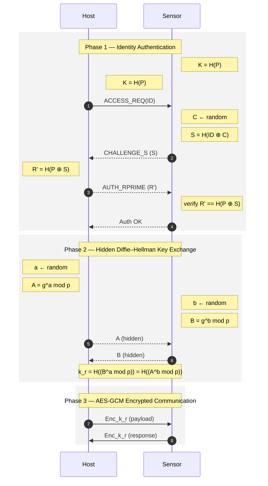

```mermaid
sequenceDiagram
    autonumber
    participant Host
    participant Sensor

    %% =========================
    %% Phase 1: Identity Authentication
    %% =========================
    rect rgba(220,220,220,0.35)
    Note over Host,Sensor: Phase 1 — Identity Authentication

    Note right of Sensor: K = H(P)
    Note left of Sensor: K = H(P)

    Host->>Sensor: ACCESS_REQ(ID)

    Note right of Sensor: C ← random
    Note right of Sensor: S = H(ID ⊕ C)

    Sensor-->>Host: CHALLENGE_S (S)

    Note left of Host: R' = H(P ⊕ S)

    Host-->>Sensor: AUTH_RPRIME (R')

    Note right of Sensor: verify R' == H(P ⊕ S)

    Sensor-->>Host: Auth OK
    end

    %% =========================
    %% Phase 2: Hidden Diffie–Hellman
    %% =========================
    rect rgba(220,220,220,0.35)
    Note over Host,Sensor: Phase 2 — Hidden Diffie–Hellman Key Exchange

    Note left of Host: a ← random
    Note left of Host: A = g^a mod p

    Note right of Sensor: b ← random
    Note right of Sensor: B = g^b mod p

    Host-->>Sensor: A (hidden)
    Sensor-->>Host: B (hidden)

    Note over Host,Sensor: k_r = H((B^a mod p)) = H((A^b mod p))
    end

    %% =========================
    %% Phase 3: Encrypted Communication
    %% =========================
    rect rgba(220,220,220,0.35)
    Note over Host,Sensor: Phase 3 — AES-GCM Encrypted Communication

    Host->>Sensor: Enc_k_r (payload)
    Sensor->>Host: Enc_k_r (response)
    end

```