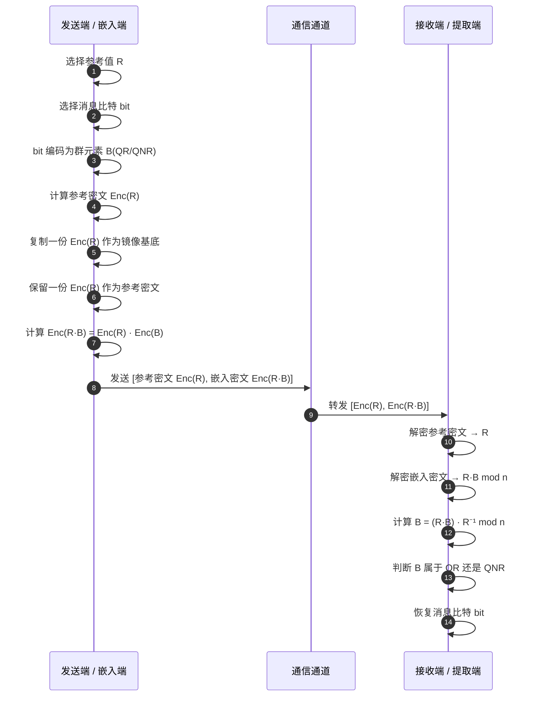

```mermaid
sequenceDiagram
    autonumber
    participant S as 发送端 / 嵌入端
    participant C as 通信通道
    participant R as 接收端 / 提取端


    S->>S: 选择参考值 R
    S->>S: 选择消息比特 bit
    S->>S: bit 编码为群元素 B(QR/QNR)

    S->>S: 计算参考密文 Enc(R)
    S->>S: 复制一份 Enc(R) 作为镜像基底
    S->>S: 保留一份 Enc(R) 作为参考密文

    S->>S: 计算 Enc(R·B) = Enc(R) · Enc(B)
    S->>C: 发送 [参考密文 Enc(R), 嵌入密文 Enc(R·B)]

    C->>R: 转发 [Enc(R), Enc(R·B)]

    R->>R: 解密参考密文 → R
    R->>R: 解密嵌入密文 → R·B mod n
    R->>R: 计算 B = (R·B) · R⁻¹ mod n
    R->>R: 判断 B 属于 QR 还是 QNR
    R->>R: 恢复消息比特 bit
```