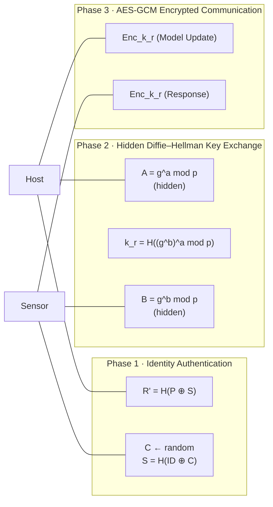

```mermaid
flowchart LR

    %% Roles
    Host[Host]
    Sensor[Sensor]

    %% -------------------------
    %% Phase 1
    %% -------------------------
    subgraph P1["Phase 1 · Identity Authentication"]
        direction LR
        H1["R' = H(P ⊕ S)"]
        S1["C ← random<br/>S = H(ID ⊕ C)"]
    end

    %% -------------------------
    %% Phase 2
    %% -------------------------
    subgraph P2["Phase 2 · Hidden Diffie–Hellman Key Exchange"]
        direction LR
        H2["A = g^a mod p<br/>(hidden)"]
        K["k_r = H((g^b)^a mod p)"]
        S2["B = g^b mod p<br/>(hidden)"]
    end

    %% -------------------------
    %% Phase 3
    %% -------------------------
    subgraph P3["Phase 3 · AES-GCM Encrypted Communication"]
        direction LR
        E1["Enc_k_r (Model Update)"]
        E2["Enc_k_r (Response)"]
    end

    %% Role alignment (visual only)
    Host --- H1
    Sensor --- S1

    Host --- H2
    Sensor --- S2

    Host --- E1
    Sensor --- E2

```